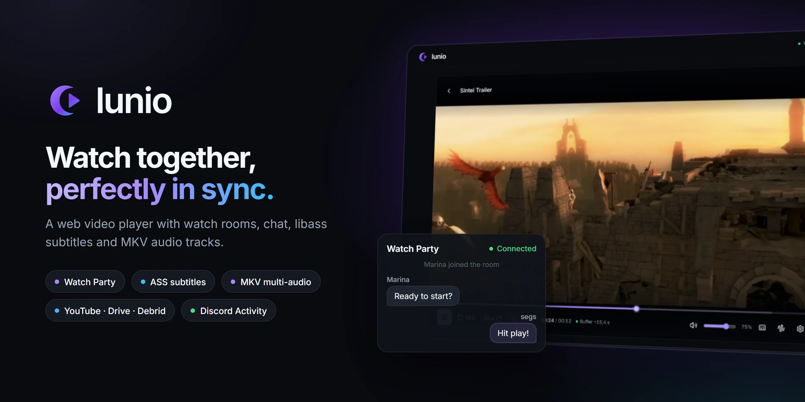

<p align="center">
  
</p>

# Lunio

**English** · [Português](README.pt-BR.md)

Lunio is a web video player built for watching together. Paste a stream link, upload a file or open a YouTube/Google Drive video, create a room, and everyone in it watches in sync — with chat, ASS subtitles rendered like a desktop player, alternate audio tracks and chapters. It also runs as a Discord Activity (in development).

## Features

- **Rooms (Watch Party)** — create a room from any source and share an 8-character code or link. The Host controls play, pause, seek and speed; everyone else follows with continuous drift correction. Chat, member list, Host transfer, kick and ban.
- **Video sources**
  - Direct stream links: Stremio, TorBox, and other debrids, `.mkv`/`.mp4`/`.webm`/HLS, proxied through the local server (HTTP Range, CORS bypass).
  - File upload (up to 50 GB) — the room exists while the file uploads. Watching alone plays the file locally without uploading.
  - YouTube videos and lives.
  - Google Drive files shared as "Anyone with the link".
- **MKV support** — audio and subtitle tracks are detected with FFmpeg. Switching to another audio track remuxes the stream to fMP4 on the fly.
- **Subtitles** — embedded ASS/SSA rendered with libass (JASSUB, WebAssembly) including embedded fonts; external `.ass`, `.srt` (converted to WebVTT) and `.vtt` by file or URL; sync offset and font size.
- **Player** — chapter-segmented timeline, "Skip intro/outro" for detected chapters, playback speed, audio delay, volume boost, aspect modes, picture-in-picture, resume where you left off, keyboard shortcuts.
- **Catalog** — browse and search movies and series (metadata from Stremio's public Cinemeta addon), with seasons, episodes and a personal list. The catalog only provides metadata: to watch, you still pick a video source.
- **Status page** — checks the local server, the catalog and your current room.

## Screenshots

| Home | Player |
|---|---|
|  |  |

<sub>Video in the screenshots: *Sintel* © Blender Foundation, [CC BY 3.0](https://creativecommons.org/licenses/by/3.0/).</sub>

## Requirements

| Tool | Needed for | Notes |
|---|---|---|
| Node.js 20+ | Everything | |
| FFmpeg | Track detection, audio track switching, subtitle extraction fallback | `FFMPEG_PATH`, then `ffmpeg` on the `PATH`, then known Windows paths (mpv, `C:\ffmpeg`) |
| Python 3.10+ | Fast embedded subtitle extraction (`mkv_extractor`) | Standard library only. Found as `PYTHON_PATH`, `python3`, `python` or `py -3`. Without it, subtitles fall back to FFmpeg (slower) |

## Getting started

```bash
npm install
npm run dev      # development (hot reload)
npm start        # production: builds, then runs the production server (no Vite)
```

Open <http://localhost:3000>. The dev server also listens on your local network, so friends on the same network can join using your machine's IP.

### Environment variables

Copy `.env.example` to `.env`. Locally nothing is required (only the Discord Activity needs the first two); on a server set at least `SESSION_SECRET` and `TRUST_PROXY`. Variables already in the environment (systemd, Docker) win over the file.

| Variable | Description |
|---|---|
| `VITE_DISCORD_CLIENT_ID` | Discord application ID used by the Activity |
| `DISCORD_CLIENT_SECRET` | Discord application secret, used by `/api/token` for the OAuth2 exchange |
| `SESSION_SECRET` | Signs the session tokens. Without it a new one is generated at each start |
| `ALLOWED_ORIGINS` | Extra origins (comma separated) allowed to call the API and open the WebSocket. Default: same origin + the Discord Activity |
| `TRUST_PROXY` | `1` behind Caddy/nginx: the client IP (used for rate limits) comes from `X-Forwarded-For` |
| `FFMPEG_PATH` | *(optional)* FFmpeg executable. Otherwise `ffmpeg` on the `PATH`, then known Windows paths |
| `PYTHON_PATH` | *(optional)* Python 3.10+ for the subtitle extractor. Otherwise `python3`, `python`, `py -3` |
| `MAX_UPLOAD_DISK_GB` / `MAX_UPLOAD_FILE_GB` | Disk quota for uploads (default 20) and size limit per upload (default 50) |
| `UPLOAD_TTL_HOURS` | Hours an upload is kept after its room closes (default 6) |
| `MAX_CACHE_GB` | Limit for `.cache/` (default 2); the least recently used is deleted first |
| `MAX_FFMPEG_PROCS` | FFmpeg/Python processes at once (default 8) |
| `ALLOW_PRIVATE_URLS` | Local tests only: lets the proxy reach private network addresses. Keep empty in production |
| `DISABLE_HMR` | *(optional)* `true` disables Vite hot reload |

## Scripts

| Command | What it does |
|---|---|
| `npm run dev` | Development: app + API + WebSocket on port 3000, with hot reload |
| `npm start` | Production: `npm run build`, then `npm run serve` |
| `npm run serve` | Production server (`src/server/main.ts`): Express serving `dist/` + API + WebSocket on `PORT` (default 3000), without Vite. Needs a previous `npm run build` |
| `npm run build` | Builds the frontend into `dist/` |
| `npm run preview` | Vite's preview of an existing `dist/` with the API plugged in (handy for quick checks; production uses `serve`) |
| `npm run lint` | Type-checks the project (`tsc --noEmit`) |
| `npm test` | Vitest: room server (join/leave, Host authority, kick/ban, empty rooms) and API routes (SSRF, uploads/quota, Range, subtitle errors). Needs FFmpeg for the media routes |
| `npm run test:e2e` | Builds, then Playwright E2E against the production server with a local FFmpeg-generated MKV (two users in one room, sync, kick/ban, alternate audio, Host reload). First time: `npx playwright install chromium` |
| `python -m pytest tests` | Runs the `mkv_extractor` tests |

> The backend lives in `src/server/` and is independent of Vite: `npm run serve` runs it as a plain Express app, and `npm run dev` / `npm run preview` just plug the same router into Vite. In development, editing a server file restarts the dev server (and drops open rooms); in production nothing watches the code, so rooms only drop on a restart or deploy.

## How it works

```
Browser (React + Vidstack)
   │  HTTP  ── /api/proxy, /api/tracks, /api/subtitle, /api/upload …
   │  WebSocket ── /api/ws (rooms, sync, chat)
   ▼
Backend: Express router (src/server/app.ts), served by src/server/main.ts in production
or plugged into the Vite dev/preview server (vite.config.ts)
   ├─ media proxy: HTTP Range passthrough, FFmpeg fMP4 remux for alternate audio
   ├─ track inspection and subtitle/font extraction (FFmpeg + mkv_extractor)
   ├─ uploads (.uploads/) and Google Drive resolver
   └─ room server (src/server/roomServer.ts)
```

### API routes

| Route | Description |
|---|---|
| `GET /api/proxy?url=` | Streams a remote video (Range support). With `audio=` it remuxes to fMP4 with that audio track |
| `GET /api/tracks?url=` | Audio, subtitle, chapter and font tracks of a file |
| `GET /api/subtitle?url=&track=` | Extracts an embedded subtitle (cached in `.cache/subtitles`) |
| `GET /api/font?url=&track=` | Extracts an embedded font |
| `GET /api/resolve?url=` | Resolves Torrentio/debrid redirects to the final CDN URL |
| `GET /api/room?id=` | Whether a room exists or was closed |
| `POST /api/upload?name=` | Uploads a file (raw body, up to 50 GB) into `.uploads/` |
| `GET /api/uploads/<id>/<name>` | Serves an uploaded file with Range support |
| `GET /api/drive?url=` | Resolves a Google Drive share link to a playable URL |
| `POST /api/session` | Session token for watching alone (room members get theirs over the WebSocket). The media routes require it |
| `GET /api/status` | Whether FFmpeg and Python were found (versions only) |
| `POST /api/token` | Discord OAuth2 code exchange |
| `WS /api/ws` | Rooms: membership, playback sync, chat, moderation |

Empty rooms are closed about 30 seconds after the last person leaves (`EMPTY_ROOM_TTL_MS` in `src/server/roomServer.ts`).

## Deploying to a Linux server (Ubuntu 24.04)

A small VPS is enough. Lunio runs as a single Node process (`npm run serve`); Caddy sits in front for HTTPS and WebSocket, and systemd keeps it running. Replace `lunio.example.com` with your domain (its DNS must point to the server) and open ports 80 and 443.

**1. Install Node 22, FFmpeg, Python and Caddy**

```bash
sudo apt update && sudo apt install -y ffmpeg python3 git curl debian-keyring debian-archive-keyring apt-transport-https
curl -fsSL https://deb.nodesource.com/setup_22.x | sudo -E bash - && sudo apt install -y nodejs
# Caddy: https://caddyserver.com/docs/install#debian-ubuntu-raspbian
sudo apt install -y caddy
```

Ubuntu's `python3` is 3.12 (Lunio needs 3.10+) and is detected automatically; there is no `python` command and none is needed.

**2. Get the code and configure**

```bash
sudo useradd --system --create-home --home-dir /opt/lunio --shell /usr/sbin/nologin lunio
sudo -u lunio git clone https://github.com/gabszap/Lunio.git /opt/lunio/app
cd /opt/lunio/app
sudo -u lunio npm ci
sudo -u lunio npm run build
sudo -u lunio cp .env.example .env
sudo -u lunio nano .env
```

In `.env` set at least:

```ini
SESSION_SECRET=<output of: openssl rand -hex 32>
TRUST_PROXY=1                              # Caddy is in front: use the real client IP
ALLOWED_ORIGINS=                           # only if the site is served from other origins too
VITE_DISCORD_CLIENT_ID=...                 # only for the Discord Activity
DISCORD_CLIENT_SECRET=...
```

Leave `ALLOW_PRIVATE_URLS` empty. It exists only for local tests and turns off the protection that keeps the server from reaching your internal network.

**3. Build and systemd service** — `/etc/systemd/system/lunio.service`

```ini
[Unit]
Description=Lunio
After=network.target

[Service]
User=lunio
WorkingDirectory=/opt/lunio/app
ExecStart=/usr/bin/npm run serve
Restart=always
RestartSec=3
Environment=NODE_ENV=production

[Install]
WantedBy=multi-user.target
```

```bash
sudo systemctl daemon-reload && sudo systemctl enable --now lunio
journalctl -u lunio -f      # at startup it logs which FFmpeg and Python it found
```

`WorkingDirectory` matters: `.uploads/`, `.cache/`, `dist/` and `.env` live there. `npm run serve` does not build, so run `npm run build` once after each `git pull` (restarts are then instant). `PORT` and `HOST` in `.env` change where it listens (default `0.0.0.0:3000`).

**4. Caddy (HTTPS + WebSocket)** — `/etc/caddy/Caddyfile`

```caddyfile
lunio.example.com {
	reverse_proxy 127.0.0.1:3000 {
		flush_interval -1
	}
}
```

```bash
sudo systemctl reload caddy
```

Caddy gets the certificate by itself and proxies WebSocket with no extra configuration, so the browser connects to `wss://lunio.example.com/api/ws`. `flush_interval -1` sends the alternate-audio stream to viewers as FFmpeg produces it, with no buffering.

**5. Check**

Open `https://lunio.example.com`, go to **Status**: Server, FFmpeg and Python should all be green. Then create a room, open it in a second browser, and switch an audio track.

**Updating:** `cd /opt/lunio/app && sudo -u lunio git pull && sudo -u lunio npm ci && sudo -u lunio npm run build && sudo systemctl restart lunio`. Restarting closes open rooms.

## Development on Windows

Everything runs on Windows without extra setup: `npm install` then `npm run dev`. FFmpeg is looked up in this order: `FFMPEG_PATH` → `ffmpeg` on the `PATH` → `C:\Program Files\mpv\ffmpeg.exe` → `C:\ffmpeg\ffmpeg.exe`. Python: `PYTHON_PATH` → `python3` → `python` → `py -3`. The server prints what it found when it starts, and **Status** shows it too. To run a second copy beside `npm run dev`, use `npx vite --port=3001 --strictPort`.

## Project structure

```
src/
  App.tsx                 Screens: Home (catalog, room, status) and player
  components/
    home/                 Room menu and source steps (stream, upload, YouTube, Drive, join)
    catalog/              Catalog, search and title details
    VideoPlayer.tsx       Player composition (Vidstack): shared state, hook order, rendering
    player/               The player's hooks (room sync, alternate audio, subtitles, controls, shortcuts…) and overlays
    PlayerControls.tsx    Controls bar and menus
    WatchPartyPanel.tsx   Chat and participants
    ui.tsx                Shared UI primitives (design system)
  lib/                    Sync client, subtitles, media helpers, catalog, Discord
  server/                 Backend: app.ts (API router), main.ts (production entry), routes/ (one file per
                          endpoint), media/ (FFmpeg remux, tracks, subtitles, cache), roomServer.ts, security
mkv_extractor/            Python extractor for subtitles inside remote MKV files (HTTP Range)
public/                   Static files: JASSUB (libass), fallback fonts, Sintel sample
docs/                     README images
DESIGN.md                 Design system notes
```

## Keyboard shortcuts

| Key | Action |
|---|---|
| `Space` / `K` | Play / pause |
| `J` / `←` · `L` / `→` | Back / forward 10 s |
| `N` / `O` | Skip intro (+90 s, or to the end of a detected intro/outro) |
| `↑` / `↓` | Volume ±5% |
| `M` | Mute |
| `C` | Toggle subtitles |
| `G` / `H` | Subtitle sync ±50 ms (`Shift` for ±250 ms) |
| `[` / `]` | Audio delay ±50 ms |
| `Z` | Aspect mode |
| `F` | Fullscreen |
| `W` | Watch Party panel |

## Known limitations

- Torrent links and screen sharing appear in the menu as "Coming soon"; they need a torrent engine and WebRTC on the server.
- Uploaded files stay in `.uploads/` until you delete them.
- A ban applies to the browser tab's identity; a new tab or another browser gets a new identity.
