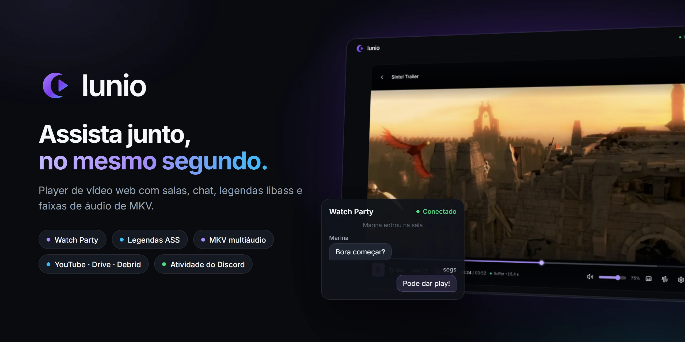
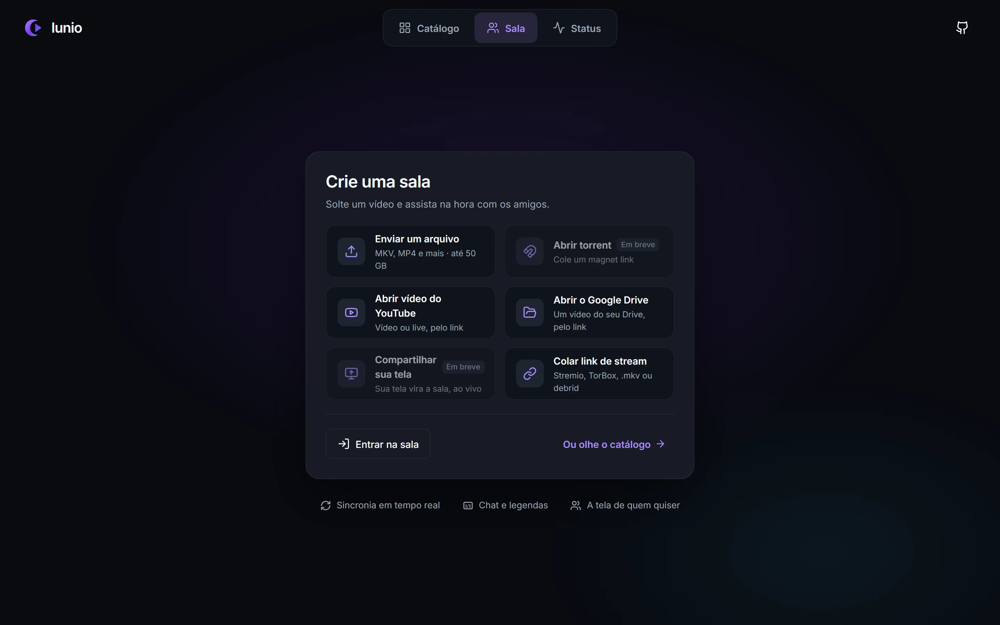
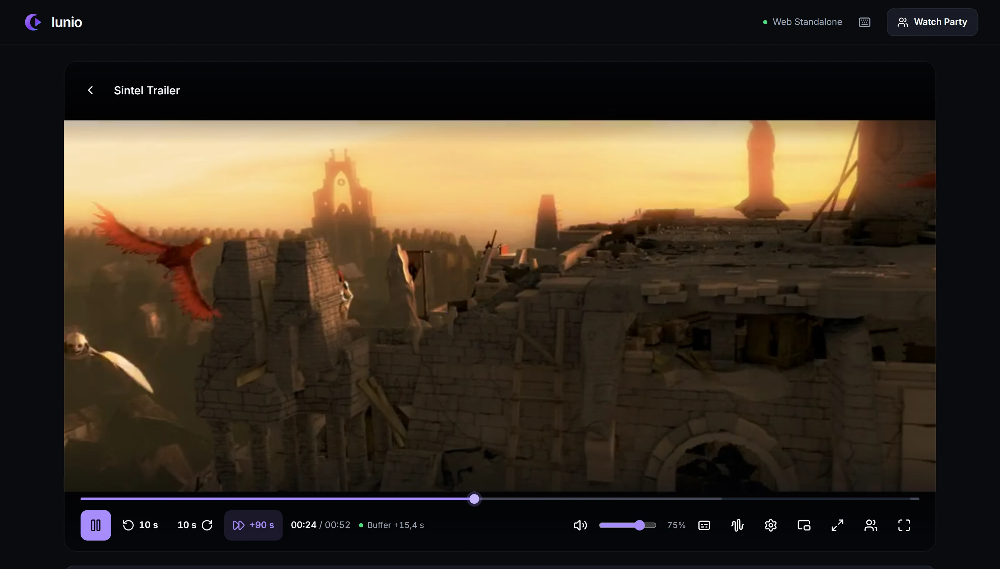

<p align="center">
  
</p>

# Lunio

[English](README.md) · **Português**

O Lunio é um player de vídeo web feito para assistir junto. Cole um link de stream, envie um arquivo ou abra um vídeo do YouTube/Google Drive, crie uma sala e todo mundo nela assiste sincronizado — com chat, legendas ASS renderizadas como num player de desktop, faixas de áudio alternativas e capítulos. Também roda como Atividade do Discord (em desenvolvimento).

## Recursos

- **Salas (Watch Party)** — crie uma sala a partir de qualquer fonte e compartilhe um código de 8 caracteres ou o link. O Host controla play, pause, seek e velocidade; os demais acompanham com correção contínua de atraso. Chat, lista de participantes, passar o Host, expulsar e banir.
- **Fontes de vídeo**
  - Links diretos de stream: Stremio, TorBox, e outros debrids, `.mkv`/`.mp4`/`.webm`/HLS, passando pelo proxy do servidor local (HTTP Range, contorna CORS).
  - Envio de arquivo (até 50 GB) — a sala já existe enquanto o arquivo sobe. Assistindo sozinho, o arquivo toca direto do computador, sem enviar.
  - Vídeos e lives do YouTube.
  - Arquivos do Google Drive compartilhados como "Qualquer pessoa com o link".
- **Suporte a MKV** — faixas de áudio e legenda detectadas com FFmpeg. Trocar para outra faixa de áudio faz remux do stream para fMP4 na hora.
- **Legendas** — ASS/SSA embutidas renderizadas com libass (JASSUB, WebAssembly), incluindo fontes embutidas; `.ass`, `.srt` (convertida para WebVTT) e `.vtt` externas por arquivo ou URL; ajuste de sincronia e tamanho da fonte.
- **Player** — timeline dividida por capítulos, "Pular abertura/encerramento" nos capítulos detectados, velocidade, atraso do áudio, volume boost, modos de ajuste de tela, picture-in-picture, continuar de onde parou, atalhos de teclado.
- **Catálogo** — navegue e busque filmes e séries (metadados do addon público Cinemeta, do Stremio), com temporadas, episódios e uma lista pessoal. O catálogo só fornece metadados: para assistir, você ainda escolhe uma fonte de vídeo.
- **Página de status** — verifica o servidor local, o catálogo e a sua sala atual.

## Capturas de tela

| Home | Player |
|---|---|
|  |  |

<sub>Vídeo nas capturas: *Sintel* © Blender Foundation, [CC BY 3.0](https://creativecommons.org/licenses/by/3.0/).</sub>

## Requisitos

| Ferramenta | Usada para | Observações |
|---|---|---|
| Node.js 20+ | Tudo | |
| FFmpeg | Detecção de faixas, troca de faixa de áudio, extração de legendas (fallback) | `FFMPEG_PATH`, depois `ffmpeg` no `PATH`, depois caminhos conhecidos do Windows (mpv, `C:\ffmpeg`) |
| Python 3.10+ | Extração rápida de legendas embutidas (`mkv_extractor`) | Só biblioteca padrão. Procurado como `PYTHON_PATH`, `python3`, `python` ou `py -3`. Sem ele, as legendas usam o FFmpeg (mais lento) |

## Como rodar

```bash
npm install
npm run dev      # desenvolvimento (hot reload)
npm start        # produção: gera o build e serve a versão otimizada
```

Abra <http://localhost:3000>. O servidor de desenvolvimento também escuta na rede local, então amigos na mesma rede podem entrar usando o IP da sua máquina.

### Variáveis de ambiente

Copie `.env.example` para `.env`. Localmente nada é obrigatório (só a Atividade do Discord usa as duas primeiras); em servidor, defina pelo menos `SESSION_SECRET` e `TRUST_PROXY`. Variáveis já definidas no ambiente (systemd, Docker) têm prioridade sobre o arquivo.

| Variável | Descrição |
|---|---|
| `VITE_DISCORD_CLIENT_ID` | ID da aplicação do Discord usada pela Atividade |
| `DISCORD_CLIENT_SECRET` | Segredo da aplicação do Discord, usado pelo `/api/token` na troca OAuth2 |
| `SESSION_SECRET` | Assina os tokens de sessão. Sem ele, um novo é gerado a cada início |
| `ALLOWED_ORIGINS` | Origens extras (separadas por vírgula) autorizadas a chamar a API e abrir o WebSocket. Padrão: a própria origem + a Atividade do Discord |
| `TRUST_PROXY` | `1` atrás de Caddy/nginx: o IP do cliente (usado nos limites) vem do `X-Forwarded-For` |
| `FFMPEG_PATH` | *(opcional)* Executável do FFmpeg. Senão, `ffmpeg` no `PATH` e depois caminhos conhecidos do Windows |
| `PYTHON_PATH` | *(opcional)* Python 3.10+ do extrator de legendas. Senão, `python3`, `python`, `py -3` |
| `MAX_UPLOAD_DISK_GB` / `MAX_UPLOAD_FILE_GB` | Cota de disco dos envios (padrão 20) e tamanho máximo de um envio (padrão 50) |
| `UPLOAD_TTL_HOURS` | Horas que um envio fica depois que a sala fecha (padrão 6) |
| `MAX_CACHE_GB` | Limite de `.cache/` (padrão 2); apaga primeiro o menos usado |
| `MAX_FFMPEG_PROCS` | Processos FFmpeg/Python ao mesmo tempo (padrão 8) |
| `ALLOW_PRIVATE_URLS` | Só para testes locais: deixa o proxy alcançar endereços de rede privada. Mantenha vazio em produção |
| `DISABLE_HMR` | *(opcional)* `true` desliga o hot reload do Vite |

## Scripts

| Comando | O que faz |
|---|---|
| `npm run dev` | Desenvolvimento: app + API + WebSocket na porta 3000, com hot reload |
| `npm start` | Produção: gera o `dist/` e serve com a API e o WebSocket na porta 3000 |
| `npm run build` | Gera o frontend em `dist/` |
| `npm run preview` | Serve um `dist/` já gerado com a API e o WebSocket (sem refazer o build) |
| `npm run lint` | Checagem de tipos (`tsc --noEmit`) |
| `python -m pytest tests` | Roda os testes do `mkv_extractor` |

> O backend (proxy de mídia, envios, salas) é um plugin do Vite registrado tanto no servidor de desenvolvimento quanto no de preview, então `npm start` roda o app completo a partir do build otimizado: minificado, sem hot reload e sem expor o código-fonte. Use `npm run dev` só enquanto estiver desenvolvendo.

## Como funciona

```
Navegador (React + Vidstack)
   │  HTTP  ── /api/proxy, /api/tracks, /api/subtitle, /api/upload …
   │  WebSocket ── /api/ws (salas, sincronia, chat)
   ▼
Servidor do Vite, dev ou preview (vite.config.ts)
   ├─ proxy de mídia: repasse com HTTP Range, remux fMP4 via FFmpeg para áudio alternativo
   ├─ inspeção de faixas e extração de legendas/fontes (FFmpeg + mkv_extractor)
   ├─ envios (.uploads/) e resolvedor do Google Drive
   └─ servidor de salas (src/server/roomServer.ts)
```

### Rotas da API

| Rota | Descrição |
|---|---|
| `GET /api/proxy?url=` | Faz o stream de um vídeo remoto (com Range). Com `audio=`, faz remux para fMP4 com essa faixa de áudio |
| `GET /api/tracks?url=` | Faixas de áudio, legenda, capítulos e fontes de um arquivo |
| `GET /api/subtitle?url=&track=` | Extrai uma legenda embutida (cache em `.cache/subtitles`) |
| `GET /api/font?url=&track=` | Extrai uma fonte embutida |
| `GET /api/resolve?url=` | Resolve redirecionamentos do Torrentio/debrid até a URL final da CDN |
| `GET /api/room?id=` | Se uma sala existe ou foi encerrada |
| `POST /api/upload?name=` | Envia um arquivo (corpo cru, até 50 GB) para `.uploads/` |
| `GET /api/uploads/<id>/<nome>` | Serve um arquivo enviado com suporte a Range |
| `GET /api/drive?url=` | Resolve um link de compartilhamento do Google Drive para uma URL reproduzível |
| `POST /api/session` | Token de sessão de quem assiste sozinho (quem está em sala recebe o seu pelo WebSocket). As rotas de mídia exigem o token |
| `GET /api/status` | Se o FFmpeg e o Python foram encontrados (só versões) |
| `POST /api/token` | Troca do código OAuth2 do Discord |
| `WS /api/ws` | Salas: participantes, sincronia de reprodução, chat, moderação |

Salas vazias são encerradas cerca de 30 segundos depois que a última pessoa sai (`EMPTY_ROOM_TTL_MS` em `src/server/roomServer.ts`).

## Deploy em um servidor Linux (Ubuntu 24.04)

Uma VPS pequena basta. O Lunio roda como um único processo Node (`npm start`); o Caddy fica na frente cuidando de HTTPS e WebSocket, e o systemd mantém tudo de pé. Troque `lunio.exemplo.com` pelo seu domínio (o DNS precisa apontar para o servidor) e libere as portas 80 e 443.

**1. Instalar Node 22, FFmpeg, Python e Caddy**

```bash
sudo apt update && sudo apt install -y ffmpeg python3 git curl debian-keyring debian-archive-keyring apt-transport-https
curl -fsSL https://deb.nodesource.com/setup_22.x | sudo -E bash - && sudo apt install -y nodejs
# Caddy: https://caddyserver.com/docs/install#debian-ubuntu-raspbian
sudo apt install -y caddy
```

O `python3` do Ubuntu é o 3.12 (o Lunio pede 3.10+) e é detectado sozinho; não existe o comando `python` e não precisa.

**2. Baixar o código e configurar**

```bash
sudo useradd --system --create-home --home-dir /opt/lunio --shell /usr/sbin/nologin lunio
sudo -u lunio git clone https://github.com/gabszap/Lunio.git /opt/lunio/app
cd /opt/lunio/app
sudo -u lunio npm ci
sudo -u lunio cp .env.example .env
sudo -u lunio nano .env
```

No `.env`, defina pelo menos:

```ini
SESSION_SECRET=<saída de: openssl rand -hex 32>
TRUST_PROXY=1                              # o Caddy está na frente: usa o IP real do cliente
ALLOWED_ORIGINS=                           # só se o site também for servido por outras origens
VITE_DISCORD_CLIENT_ID=...                 # só para a Atividade do Discord
DISCORD_CLIENT_SECRET=...
```

Deixe `ALLOW_PRIVATE_URLS` vazio. Ele existe só para testes locais e desliga a proteção que impede o servidor de alcançar a sua rede interna.

**3. Serviço systemd** — `/etc/systemd/system/lunio.service`

```ini
[Unit]
Description=Lunio
After=network.target

[Service]
User=lunio
WorkingDirectory=/opt/lunio/app
ExecStart=/usr/bin/npm start
Restart=always
RestartSec=3
Environment=NODE_ENV=production

[Install]
WantedBy=multi-user.target
```

```bash
sudo systemctl daemon-reload && sudo systemctl enable --now lunio
journalctl -u lunio -f      # ao iniciar, mostra qual FFmpeg e qual Python foram encontrados
```

O `WorkingDirectory` importa: `.uploads/`, `.cache/` e `.env` ficam nele. O `npm start` refaz o build do frontend a cada início (uns 30 s); para pular isso depois de um deploy, rode `npm run build` uma vez e use `ExecStart=/usr/bin/npx vite preview`.

**4. Caddy (HTTPS + WebSocket)** — `/etc/caddy/Caddyfile`

```caddyfile
lunio.exemplo.com {
	reverse_proxy 127.0.0.1:3000 {
		flush_interval -1
	}
}
```

```bash
sudo systemctl reload caddy
```

O Caddy obtém o certificado sozinho e faz proxy de WebSocket sem configuração extra, então o navegador conecta em `wss://lunio.exemplo.com/api/ws`. O `flush_interval -1` entrega o stream de áudio alternativo aos espectadores conforme o FFmpeg produz, sem buffer.

**5. Conferir**

Abra `https://lunio.exemplo.com` e vá em **Status**: Servidor, FFmpeg e Python devem estar verdes. Depois crie uma sala, entre por um segundo navegador e troque a faixa de áudio.

**Atualizar:** `cd /opt/lunio/app && sudo -u lunio git pull && sudo -u lunio npm ci && sudo systemctl restart lunio`. Reiniciar encerra as salas abertas.

## Desenvolvimento no Windows

Tudo roda no Windows sem configuração extra: `npm install` e `npm run dev`. O FFmpeg é procurado nesta ordem: `FFMPEG_PATH` → `ffmpeg` no `PATH` → `C:\Program Files\mpv\ffmpeg.exe` → `C:\ffmpeg\ffmpeg.exe`. O Python: `PYTHON_PATH` → `python3` → `python` → `py -3`. O servidor imprime o que encontrou ao iniciar, e a aba **Status** também mostra. Para rodar uma segunda cópia ao lado do `npm run dev`, use `npx vite --port=3001 --strictPort`.

## Estrutura do projeto

```
src/
  App.tsx                 Telas: Home (catálogo, sala, status) e player
  components/
    home/                 Menu da sala e passos de cada fonte (stream, envio, YouTube, Drive, entrar)
    catalog/              Catálogo, busca e detalhes do título
    VideoPlayer.tsx       Núcleo do player (Vidstack), sincronia, overlays
    PlayerControls.tsx    Barra de controles e menus
    WatchPartyPanel.tsx   Chat e participantes
    ui.tsx                Componentes visuais compartilhados (design system)
  lib/                    Cliente de sincronia, legendas, utilitários de mídia, catálogo, Discord
  server/                 Servidor de salas e rotas de envio/Drive
mkv_extractor/            Extrator em Python de legendas de MKV remotos (HTTP Range)
public/                   Arquivos estáticos: JASSUB (libass), fontes de fallback, exemplo Sintel
docs/                     Imagens do README
DESIGN.md                 Notas do design system
```

## Atalhos de teclado

| Tecla | Ação |
|---|---|
| `Espaço` / `K` | Play / pause |
| `J` / `←` · `L` / `→` | Voltar / avançar 10 s |
| `N` / `O` | Pular abertura (+90 s, ou até o fim da abertura/encerramento detectado) |
| `↑` / `↓` | Volume ±5% |
| `M` | Silenciar |
| `C` | Ligar/desligar legendas |
| `G` / `H` | Sincronia da legenda ±50 ms (`Shift` para ±250 ms) |
| `[` / `]` | Atraso do áudio ±50 ms |
| `Z` | Ajuste de tela |
| `F` | Tela cheia |
| `W` | Painel da Watch Party |

## Limitações conhecidas

- Links de torrent e compartilhamento de tela aparecem no menu como "Em breve"; precisam de um motor de torrent e de WebRTC no servidor.
- Arquivos enviados ficam em `.uploads/` até você apagá-los.
- O ban vale para a identidade da aba do navegador; uma aba nova ou outro navegador recebe uma identidade nova.
